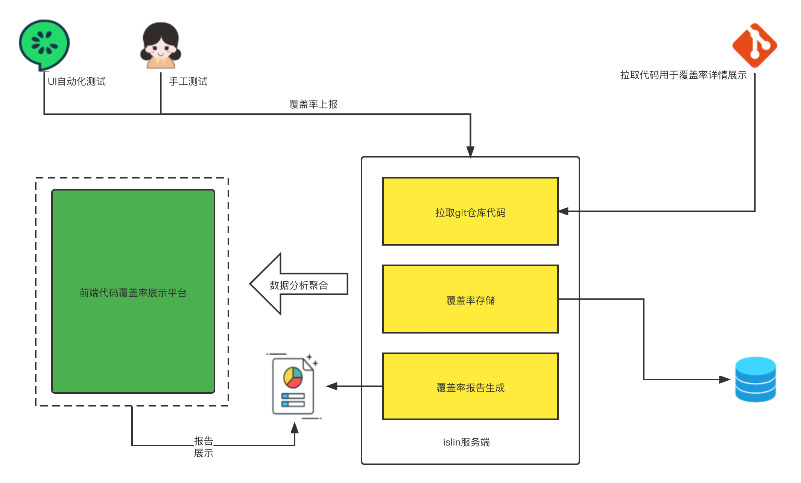

# 架构图

1.提供babel-plugin-canyon配合babel-plugin-istanbul配置工程信息和代码插桩。

2.工程构建完毕后，经过UI自动化测试或手工测试，结束后将覆盖率上报至canyon服务端。

3.服务端通过配置的git源和仓库ID拉取代码用于覆盖率详情展示。覆盖率数据和对应工程信息存入database，
与此同时会根据预先配置的工程信息实时生成覆盖率报告文件。

4.提供web界面用户新增、查询工程覆盖率信息。

