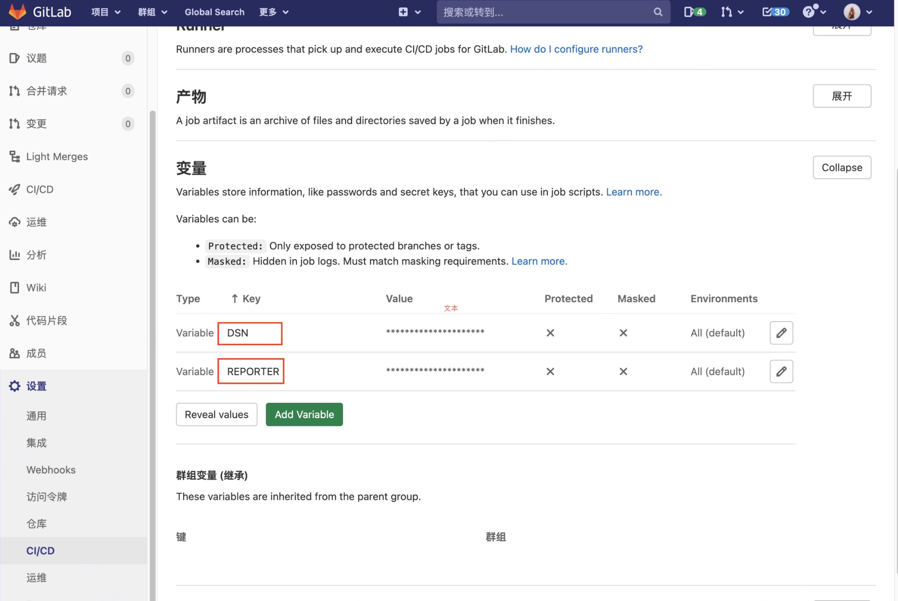

# 上报第一个覆盖率

## 代码插桩

前端工程化、模块化离不开babel。如果说你的项目是的话，只需要安装两个babel插件即可快速开始，  
[`babel-plugin-istanbul`](https://github.com/istanbuljs/babel-plugin-istanbul) 是istanbul官方维护的babel插件。  
[`babel-plugin-canyon`](https://github.com/canyon-project/babel-plugin-canyon) 我们是为了便于用户配置项目信息的babel插件。

```shell
npm i babel-plugin-istanbul babel-plugin-canyon -D  
```

在babel中配置

```json
{
  "plugins": [
    "istanbul",
    "canyon"
  ]
}  
```

:::tip

babel-plugin-canyon 插件不仅将用户配置的信息存在**window.\_\_canyon\_\_**上，并且提供了**window.reportCoverage**方法供调用。

:::

babel-plugin-canyon 插件不仅将用户配置的信息存在的**window.canyon**上，并且还在window上添加了一个**reportCoverage**方法供调用。

## 构建时配置

在gitlab仓库的ci中配置构建时环境变量



## 覆盖率上报

需要在每个页面case结束时，触发window上的reportCoverage方法，将覆盖率上报。

```js
window.reportCoverage()  
```

## 亦可手工测试(提供 [canyon-crx](https://chrome.google.com/webstore/detail/islin-crx/omnpafdjidgpdmlimbangcjjaaodbeof?hl=zh-CN&authuser=0) Chrome扩展)

## 参数解释

dns: 覆盖率上报接口

reporter: 上报人的身份令牌

repoId: 仓库ID，会自动读取环境变量CI_PROJECT_ID

commitSha: 会自动读取环境变量CI_COMMIT_SHA

coverage: 项目覆盖率对象
